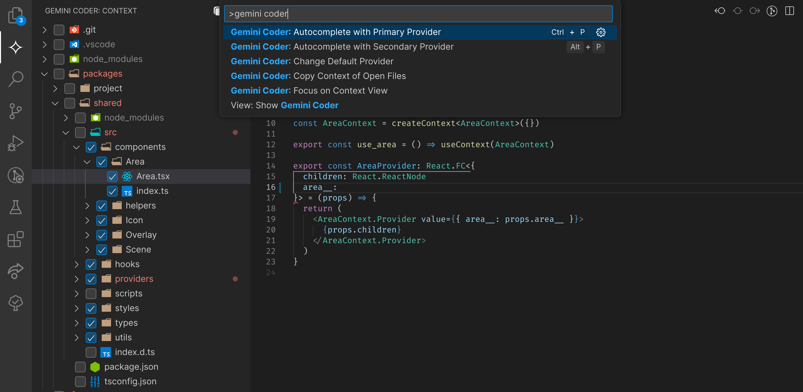

# Gemini Coder

## Description

Gemini Coder let's you use, by default, Gemini Pro and Gemini Flash models as a fill-in-the-middle coding assistant. With special prompting techinque the extension fills missing code while utilizing Gemini's large context window and top intelligence.

Sources of context enabled by default: all open files, selected folders and files in the Context Pane:

preview image:

## How to Use

1. Open context view and select all relevant folders/files which you want to attach as context in each completion request.
2. Place the cursor where you want to insert code completion.
3. Open the Command Palette (`Ctrl+Shift+P`).
4. Run the command `Gemini FIM: Autocomplete ...`.
5. Bind the command to a key combination of your choice in `Preferences: Open Keyboard Shortcuts`, e.g. Ctrl+P for primary model and Alt+P for secondary model.

## Features
- Specify your primary and secondary models, e.g. Gemini Flash (primary), Gemini Pro (secondary, used for more complex code).
- Autocomplete on cursor position.
- Copy all open tabs as context to use in GUIs like AI Studio.
- Copy context of selected folders/files.
- Rate limited Gemini Pro requests fallback to Gemini Flash.
- Supports other OpenAI API compatible providers.

## Author

Robert Piosik

Check out my open source browser extension and app "Taaabs" https://chromewebstore.google.com/detail/taaabs-zero-knowledge-boo/mfpmbjjgeklnhjmpahigldafhcdoaona

## License

MIT
