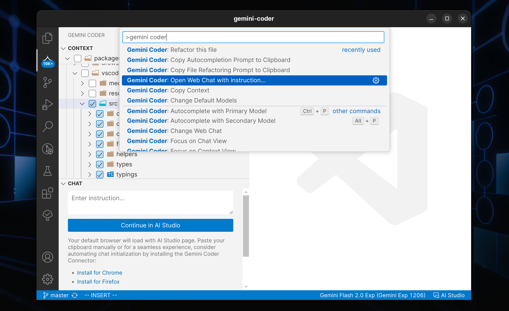

# Gemini Coder

## Description

Meet Gemini Coder, many useful AI commands for your Command Palette with first-class support for Gemini.

Use big models for FIM autocomplete, refactor any file or chat about your code.

**You decide what is sent to the model.** In a context panel, you can granularly select folders and files attached to each request. You have whole 2M context window at your disposal!

The extension's chat panel bridges VS Code and AI Studio. Select context, compose your prompt and continue in the browser with just one click!

For a seamless developer experience, install our browser integration for hands-free prompt pasting into AI Studio.

- [Install for Chrome](https://chromewebstore.google.com/detail/gemini-coder-connector/ljookipcanaglfaocjbgdicfbdhhjffp)
- [Install for Firefox](https://addons.mozilla.org/en-US/firefox/addon/gemini-coder-connector/)

[]()

## Features

- Lightweight, 100% free, MIT licensed.
- Granularly set context for all requests.
- Autocomplete at the cursor position.
- Chat about your code in AI Studio.
- Refactor files.
- Rate limited Gemini Pro requests fallback to Gemini Flash.
- Provider agnostic - use any OpenAI API compatible LLM provider and choose from many web chats (AI Studio, DeepSeek, and more).

## How to use FIM autocompletion

1.  Open the Context View and select all relevant folders/files you want to attach as context in each request.
2.  Place the cursor where you want to insert code completion.
3.  Open the Command Palette (`Ctrl+Shift+P`).
4.  Run one of the following commands (listed below).
5.  Bind commands to a key combination of your choice in `Preferences: Open Keyboard Shortcuts`, e.g., `Ctrl+P` for `Gemini Coder: Autocomplete with Primary Model` and `Alt+P` for `Gemini Coder: Autocomplete with Secondary Model`.

## Commands

- `Gemini Coder: Copy Context`: Copies the selected files' content to the clipboard.
- `Gemini Coder: Autocomplete with Primary Model`: Uses the primary model to autocomplete code at the cursor position.
- `Gemini Coder: Autocomplete with Secondary Model`: Uses the secondary model to autocomplete code at the cursor position.
- `Gemini Coder: Copy Autocompletion Prompt to Clipboard`: Copies the current autocompletion prompt to the clipboard.
- `Gemini Coder: Change Default Models`: Allows you to change the default primary and secondary models.
- `Gemini Coder: Refactor this file`: Refactors the current file based on the provided instruction.
- `Gemini Coder: Copy File Refactoring Prompt to Clipboard`: Copies the refactoring prompt to the clipboard.
- `Gemini Coder: Open Web Chat with instruction...`: Copies the instruction with context to the clipboard and opens the selected web chat.
- `Gemini Coder: Open Web Chat with Autocompletion Prompt`: Copies the current autocompletion prompt to the clipboard and opens the selected web chat.
- `Gemini Coder: Open Web Chat with file refactoring prompt...`: Copies the refactoring prompt to the clipboard and opens the selected web chat.

## Set up custom providers

```json
  "geminiCoder.providers": [
    // Gemini Experimental
    {
      "name": "Gemini Flash 2.0 Exp",
      "endpointUrl": "https://generativelanguage.googleapis.com/v1beta/chat/completions",
      "bearerToken": "[API KEY]",
      "model": "gemini-2.0-flash-exp",
      "temperature": 0,
      "instruction": ""
    },
    {
      "name": "Gemini Exp 1206",
      "endpointUrl": "https://generativelanguage.googleapis.com/v1beta/chat/completions",
      "bearerToken": "[API KEY]",
      "model": "gemini-exp-1206",
      "temperature": 0,
      "instruction": ""
    },
    // Others
    {
      "name": "DeepSeek",
      "endpointUrl": "https://api.deepseek.com/v1/chat/completions",
      "bearerToken": "[API KEY]",
      "model": "deepseek-chat",
      "temperature": 0,
      "instruction": ""
    },
    {
      "name": "Mistral Large Latest",
      "endpointUrl": "https://api.mistral.ai/v1/chat/completions",
      "bearerToken": "[API KEY]",
      "model": "mistral-large-latest",
      "temperature": 0,
      "instruction": ""
    },
  ],
```

## License

MIT

This is not an official Google product.

## Author

Robert Piosik, [follow on X](https://x.com/robertpiosik).